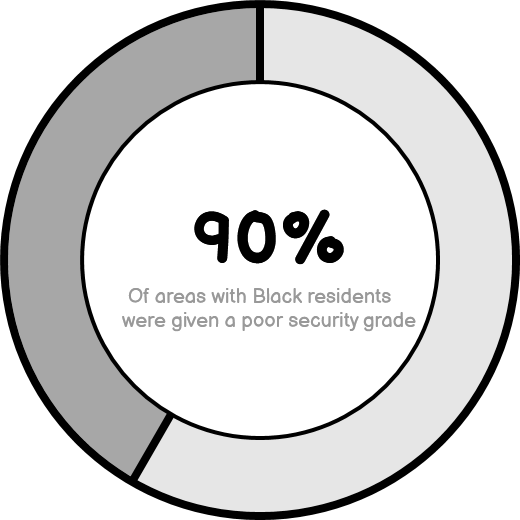
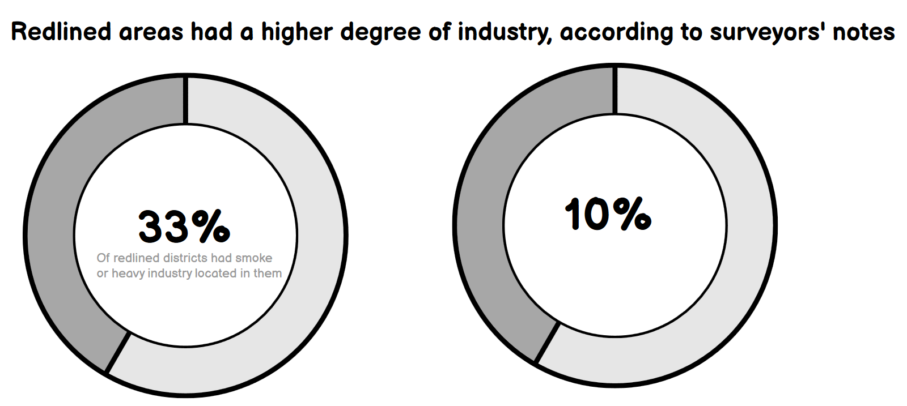
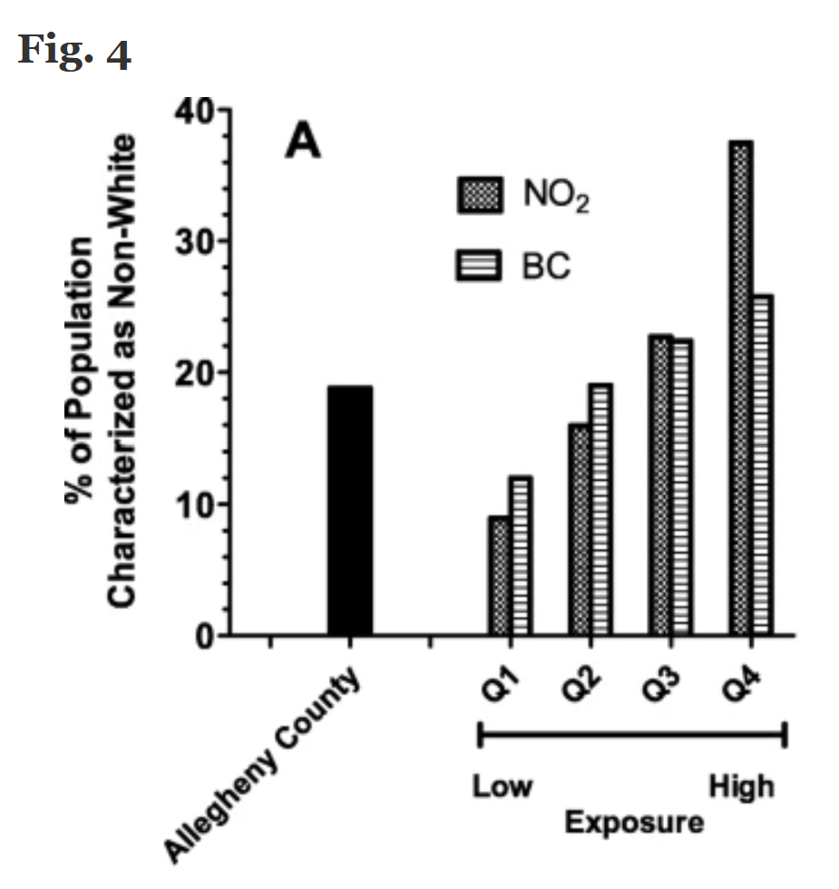
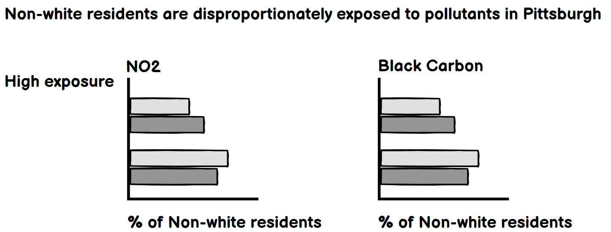

# Final: Calling for Environmental Justice in Pittsburgh
To return to the front page, click [here](https://jameson-c.github.io/viz-portfolio).
## Background and Summary
For this project proposal I will provide the outline of my project and process, but also some of the evidence that informs my interpretations of the data. In the following section I:
* Substantiate how Pittsburgh's policies of redlining and industrial zoning forced Black families to live in areas with higher pollution.
* Identify that many of the landscapes which were sculpted by these policies remain intact today.
* Note that because of this, Black Pittsburghers have worse health outcomes.

Armed with these points, I will call my readers to donate to [environmental justice groups](https://nextpittsburgh.com/environment/35-pittsburgh-environmental-groups-renew-commitment-to-equity-and-racial-justice/) in the area in my final data visualization exercise.

### On Redlining in Pittsburgh
During the late 1930's, cities across the United States produced maps which were used to bar Black and other marginalized communities from taking advantage of new federal programs which insured mortgages. These maps were ostensibly created to judge whether it was wise to finance homes in a given area. But they predominantly enforced racist ideals, often giving Black communities a poor grade and making special note of whether Black families were 'infiltrating' white areas. A red line would be drawn around these communities on the map, telling bankers not lend to anyone within its boundaries. Hence the term redlining. In Pittsburgh, the practice resulted in the following map:

On the original forms used to create this map, the presence of Black families was viewed as a detriment to the community and resulted in a lower grade.[^1] Very few communities where Black families were mentioned received a B or better, and none received an A. Today, Pittsburgh has a serious homeownership gap between white and Black families due to this and other ensuing policies which created racialized barriers to homeownership.[^2] But this injustice is not the subject of this project. In the field notes used to inform redlining maps, many of the areas with Black residents were noted as having detrimental smoke from the steel mills. None of the 'A' security grade zones, which were entirely white, displayed any mention of smoke. But why were these communities near the mills to begin with? The next section explores that question.

### On Racism and Industrial Zoning
Before redlining, zoning maps were also used to enforce racial segregation.[^3] Zoning maps are planning documents that city officials create to dictate how a given area can be used and what can be built there. In 1923, Pittsburgh created zones where only single-family homes could be built, blocking Black and other low income families who often lived in denser housing from those areas. The debates leading up to Pittsburgh's first zoning plan centered around preserving neighborhoods' home values, and at the time this often meant keeping Black families out of those neighborhoods. Through this plan, the city entrenched racist hierarchies into its landscape. As a part of this process, they created industrial zones in response to fears that the steel mills (and their 'undesirable' workers) were encroaching on historically residential, wealthy white neighborhoods.[^4] Most of these zones were placed in Black communities.

The final ordinance passed in 1923 defined five districts: Heavy Industrial, Light Industrial, Commercial, "A" Residence (for single-family homes), and "B" Residence (for denser developments). The maps largely maintained the existing industrial and residential patterns seen in Pittsburgh at the time.[^5] Industry was largely zoned to areas near the river and transit corridors leading into the city. These zones, though they reflected the necessary logistics of industrial manufacturing, also reflected racist practices and history. And further, they set the legacies of that history in stone. One of the purposes of industrial zoning was to keep factories away from white neighborhoods. Zoning insured white property values by ensuring that few industrial or environmentally unsafe businesses could enter their neighborhoods. Polluters had no choice but to continue to build and operate in disproportionately Black neighorhoods.[^6] All the while, Black families were systematically barred from neighborhoods located further from the industrial core of the city.

### In Summary: On These Policies and Environmental Injustice
These zoning and redlining decisions led to an environment where Black Pittsburghers were (and continue to be) systematically exposed to pollutants. Redlining, alongside many other factors, prevented Black families from being able to move freely away from industrial zones. To this day, Black Pittsburghers experience worse health outcomes that are associated with pollution, as many continue to live in neighborhoods which were originally redlined.[^7] This is the subject I would like to explore in my final project. I hope to use data viz to explore some of these injustices and call my readers to action.

## Outline
For this project, I am interested in conveying some of the history I just described, then shifting toward modern legacies of that history, and finally asking my readers to act. As I stated earlier, my hope is to inspire readers to contribute to environemntal justice organizations in the area.
Generally, I will ask, "Why do Black Pittsburghers have worse respiratory health?" and then follow the following structure:
#### The Setup
Many Black Pittsburghers continue to live in areas that were redlined in the 1930's. Here I draw the link between the past and the present.
#### The Conflict
These ex-redlined areas also tend to be near industrial zones and so residents are disproportionately exposed to environmental toxins. Here I introduce the complexity of how redlining connects to industrial zoning.
#### The Resolution
Finally I reveal information about Black Pittsburghers' respiratory health from research out the University of Pittsburgh. This is where I try to marry the setup and conflict into a clear summary point.

With this, I will then ask the reader to donate to [environmental justice groups](https://nextpittsburgh.com/environment/35-pittsburgh-environmental-groups-renew-commitment-to-equity-and-racial-justice/) in the Pittsburgh area.

### The Data
The first source I will be using is a geojson file produced by the University of Richmond's [Mapping Inequality Project](https://dsl.richmond.edu/panorama/redlining/#loc=11/40.442/-80.172&city=pittsburgh-pa&text=downloads). This file contains geographic boundaries of the residential security maps used for redlining, comments from surveyors about different communities, and rough estimates of racial composition. I will use this to ground the conversation and map the past to the present. Additionally, I will show some data from the surveyors' notes to help show the point that redlined maps were racist. I will connect this dataset with modern landscapes by mapping modern [census tract demographics](https://www.census.gov/data/developers/data-sets/acs-5year.html) and overlaying redlining zones.

The next souce I will utilize is data tracking large emitters of greenhouse gases from the EPA's [FLIGHT database](https://ghgdata.epa.gov/ghgp/main.do#/facility/?q=Pittsburgh&st=PA&bs=&et=&fid=&sf=11001100&lowE=-20000&highE=23000000&g1=1&g2=1&g3=1&g4=1&g5=1&g6=0&g7=1&g8=1&g9=1&g10=1&g11=1&g12=1&s1=1&s2=1&s3=1&s4=1&s5=1&s6=1&s7=1&s8=1&s9=1&s10=1&s201=1&s202=1&s203=1&s204=1&s301=1&s302=1&s303=1&s304=1&s305=1&s306=1&s307=1&s401=1&s402=1&s403=1&s404=1&s405=1&s601=1&s602=1&s701=1&s702=1&s703=1&s704=1&s705=1&s706=1&s707=1&s708=1&s709=1&s710=1&s711=1&s801=1&s802=1&s803=1&s804=1&s805=1&s806=1&s807=1&s808=1&s809=1&s810=1&s901=1&s902=1&s903=1&s904=1&s905=1&s906=1&s907=1&s908=1&s909=1&s910=1&s911=1&si=&ss=&so=0&ds=E&yr=2020&tr=current&cyr=2020&ol=0&sl=0&rs=ALL). I will use this alongside the [Toxics Release Inventory](https://www.epa.gov/toxics-release-inventory-tri-program/tri-basic-plus-data-files-calendar-years-1987-present), a dataset used by PennEnvironment Research & Policy Center to find the ["Toxic Ten"](https://toxicten.org/) worst polluters in Allegheny County. These sources are meant to highlight the location of industries that could be leading to worse health outcomes in the Black community here.

Finally, I will be using [results from a paper](https://ehjournal.biomedcentral.com/articles/10.1186/s12940-020-00584-z) published in Environmental Health, as a way of grounding these locational findings with actual outcomes in a person's health. Drawing the link will require a few different findings from this and other papers from the Environmental Justice literature. This part is quite important. I acknowledge that I may not be able to obtain a causal statement that reflects findings from my historical analysis, but I will be sure to make that known to the reader. My hope, in the least, is to drawn attention to the fact that many Black families are living close to industrial pollution sources, a path that was set for them by long-dead racist policymakers and industrialists. 

### Initial Wireframes and Plots
Next, I will show some sketches mapping how I plan to convey my points, in the order I hope to convey them. This is mainly a design exercise which will help me determine how the story will flow. For the most part, I use Balsamiq to mock these charts up. Also I have included a preliminary Tableau map. Basically, I think that I want to keep the number of geographic representations to a minimum because it can be difficult to process too many maps at once. I want to reserve maps for only the points that I am most interested in showing geographically.

#### Point 1: Areas with Black residents were given worse security grades by the surveyors
I think that a donut chart works pretty well for this, but I will say I am a bit concerned about the data I am using for this. All I have is whether a district had Black residents, rather than an understanding of the total proportion of Black residents living in redlined areas. So maybe I need to reframe this in the final display.
##### Title: Black residents lived primarily in redlined areas

#### Point 2: Many of the mentions in surveyor's notes about smoke occurred in Black areas.
##### Title: Surveyors' notes indicate that redlined areas were more likely to be industrial
This is meant to act as a proxy, in some ways, of the actual zoning map used at the time. I have been unable to identify an industrial zoning map from 1923 and am instead armed only with recollections of the process and descriptions of the resulting map from a paper written in the 1970's. If I cannot find it, I will try to use the point about smoke in surveyor's notes. I am not sure how compelling the data will be. Of the redlined areas where smoke is mentioned or local mill employment is mentioned in the surveyor's notes, 20 are of poor security grade and most of these areas have at least some Black residents. The comparison here is that in white areas, smoke and living near a factory seems less likely according to the surveyors. This may be the best data I have, if I cannot find a version of the 1923 zoning plan.

Another option could be to use two stacked bar charts. That might make this easier to compare across groups.
#### Point 3: Today, industries are still located in these same areas
##### Title: Modern Large Emitters Are Located in Areas that were Redlined in the 1930's
For this exercise, I opted to try and evaluate the relationship between redlining and environmental hazards in those communities. Normally I would not start with a full viz exercise but I wanted to get some practice in Tableau and get a better sense of the data. First, I obtained data tracking large emitters of greenhouse gases from the EPA's [FLIGHT database](https://ghgdata.epa.gov/ghgp/main.do#/facility/?q=Pittsburgh&st=PA&bs=&et=&fid=&sf=11001100&lowE=-20000&highE=23000000&g1=1&g2=1&g3=1&g4=1&g5=1&g6=0&g7=1&g8=1&g9=1&g10=1&g11=1&g12=1&s1=1&s2=1&s3=1&s4=1&s5=1&s6=1&s7=1&s8=1&s9=1&s10=1&s201=1&s202=1&s203=1&s204=1&s301=1&s302=1&s303=1&s304=1&s305=1&s306=1&s307=1&s401=1&s402=1&s403=1&s404=1&s405=1&s601=1&s602=1&s701=1&s702=1&s703=1&s704=1&s705=1&s706=1&s707=1&s708=1&s709=1&s710=1&s711=1&s801=1&s802=1&s803=1&s804=1&s805=1&s806=1&s807=1&s808=1&s809=1&s810=1&s901=1&s902=1&s903=1&s904=1&s905=1&s906=1&s907=1&s908=1&s909=1&s910=1&s911=1&si=&ss=&so=0&ds=E&yr=2020&tr=current&cyr=2020&ol=0&sl=0&rs=ALL). This is a proxy for what I will eventually end up mapping because different types of emissions are worse for human health than others. Additionally, I have given some thought to doing something with air quality though it was suggested that we avoid that topic for the final.  Anyway, then I overlaid a map of the communities that were redlined in the 1930's, obtained by the [Mapping Inequality Project](https://dsl.richmond.edu/panorama/redlining/#loc=11/40.442/-80.172&city=pittsburgh-pa&text=downloads).

From here, I produced the following map:

<noscript></noscript><object class='tableauViz'  style='display:none;'><param name='host_url' value='https%3A%2F%2Fpublic.tableau.com%2F' /> <param name='embed_code_version' value='3' /> <param name='site_root' value='' /><param name='name' value='PittsburghRedlining&#47;Sheet1' /><param name='tabs' value='no' /><param name='toolbar' value='yes' /><param name='static_image' value='https:&#47;&#47;public.tableau.com&#47;static&#47;images&#47;Pi&#47;PittsburghRedlining&#47;Sheet1&#47;1.png' /> <param name='animate_transition' value='yes' /><param name='display_static_image' value='yes' /><param name='display_spinner' value='yes' /><param name='display_overlay' value='yes' /><param name='display_count' value='yes' /><param name='language' value='en-US' /><param name='filter' value='publish=yes' /></object>

#### Point 4: Black families continue to disproportionately live in areas that were redlined.
##### Title: Black families continue to reside in areas that were redlined in the 1930's.
This mockup is meant to drive the point that Black families continue to reside in areas that were redlined in the 1930's, confirming the currency of the problem. I need to figure out a way to map the racial composition of parts of the county that do not interset with the 'D' grade, because that shows my observation more clearly. This shows the percentage population of Black families in each Census tract.

<noscript></noscript><object class='tableauViz'  style='display:none;'><param name='host_url' value='https%3A%2F%2Fpublic.tableau.com%2F' /> <param name='embed_code_version' value='3' /> <param name='site_root' value='' /><param name='name' value='Pittsburghareasredlinedin1930s&#47;Sheet1' /><param name='tabs' value='no' /><param name='toolbar' value='yes' /><param name='static_image' value='https:&#47;&#47;public.tableau.com&#47;static&#47;images&#47;Pi&#47;Pittsburghareasredlinedin1930s&#47;Sheet1&#47;1.png' /> <param name='animate_transition' value='yes' /><param name='display_static_image' value='yes' /><param name='display_spinner' value='yes' /><param name='display_overlay' value='yes' /><param name='display_count' value='yes' /><param name='language' value='en-US' /><param name='filter' value='publish=yes' /></object>
                

#### Point 5: Black folks disproportionately suffer from exposure to pollution.
Finally, this mockup is meant to drive the point that Black individuals are exposed to pollutants more often and that outcomes are worse. For this, I will be redesigning the following graph, which tracks exposure to pollutants by race:

While pointing out some statistics on the substantial outcomes are. I am not yet sure what outcomes I will track because I am not a scientist and need to spend some more time with the paper I sourced this from. Specifically, I was hoping to redesign the chart by making two separate charts for Black Carbon and NO2 exposure, removing the overall Allegheny County number, to produce something like this:

My only qualm with this representation is that the focus of my work so far has been asking how these policies affeted the Black community, specifically. I have some issues with just lumping non-white racial and ethnic groups together in viz work and hope that I can find something a bit more targeted for the final.

### Method and Medium
For my final, I plan on creating a Shorthand story that guides the reader through the history and various facts presented here. Specifically, I would like to track some of the historical developments I describe above in a timeline of some variety, supplementing with data viz and infographics here and there. As I said earlier, zoning and redlining decisions led to an environment where Black Pittsburghers were (and continue to be) systematically exposed to pollutants. I would like to, as the reader scrolls, give them a sense of that. 

I also hope to produce some interactive graphics, though the specifics depend a bit on how the data shape out. I would be interested in exploring the pollutant dataset more closely, for example, to see how far back those data track. It could be interesting to do an interactive where as the reader scrolls, they advance a timeline tracking industrial use in redlined neighborhoods. This would be especially important considering Pittsburgh's industrial collapse: it is not safe to assume that the modern landscape reflects that of the 80's. 

Finally, I plan to produce a call to action for my readers, presented on the shorthand page and during a 1-minute presentation for my fellow classmates. I think it is particularly important to think about the ethics of what numbers and data I use to inspire action. Generally, I want to avoid stroking the audience's savior complex in asking for help. Instead, I hope to elicit a feeling that people can support inspiring organizing efforts happening in the Black community in Pittsburgh, rather than a sense of pity. To do this, I might use something that does not even relate to the substantiating evidence that supports the project. My main point to the audience could even be something as simple as counting out how many organizations are doing this important work.

### References
[^1]: Robert K. Nelson, LaDale Winling, Richard Marciano, Nathan Connolly, et al., “Mapping Inequality,” American Panorama, ed. Robert K. Nelson and Edward L. Ayers, accessed September 25, 2022, https://dsl.richmond.edu/panorama/redlining/#loc=11/40.442/-80.172&city=pittsburgh-pa&text=downloads
[^2]: Rutan, Devin Q., and Glass, Michael R. 2017. The Lingering Effects of Neighborhood Appraisal: Evaluating Redlining's Legacy in Pittsburgh. The Professional Geographer, 70:3, 339-349. https://www.tandfonline.com/doi/full/10.1080/00330124.2017.1371610
[^3]: Rothstein, Richard. 2018. The Color of Law: A Forgotten History of how Our Government Segregated America. New York, NY: Liveright Publishing Corporation. 55-56.
[^4]: Lloyd, Anne. 1974. Pittsburgh's 1923 Zoning Ordinance. Pittsburgh, PA: Carnegie Mellon University. 296.
[^5]: Ibid., 303.
[^6]: Rothstein, Richard. 2018. The Color of Law: A Forgotten History of how Our Government Segregated America. New York, NY: Liveright Publishing Corporation. Chapter 3.
[^7]: Marusic, Kristina. 2020. Environmental injustice in Pittsburgh: Poor, minority neighborhoods see higher rates of deaths from air pollution. Environmental Health News. https://www.ehn.org/environmental-injustice-pittsburgh-air-pollution-2646169635/particle-1
[^8]: Rutan, Devin Q., and Glass, Michael R. 2017. The Lingering Effects of Neighborhood Appraisal: Evaluating Redlining's Legacy in Pittsburgh. The Professional Geographer, 70:3, 339-349. https://www.tandfonline.com/doi/full/10.1080/00330124.2017.1371610

