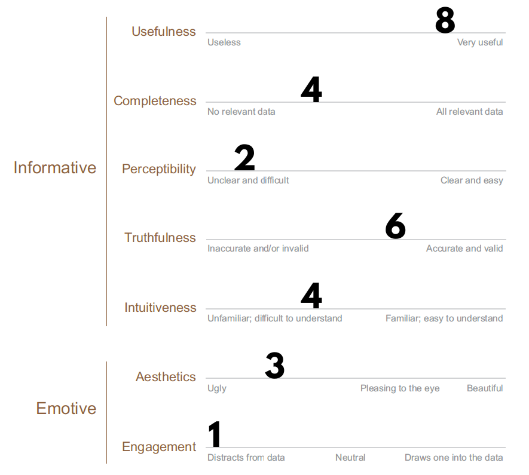
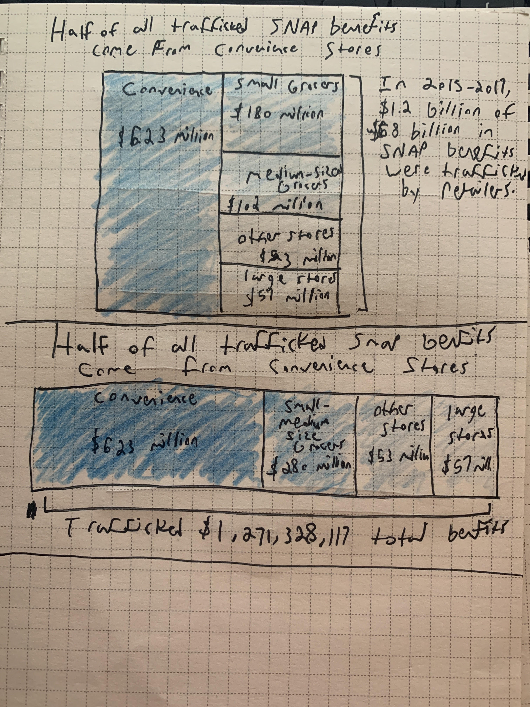
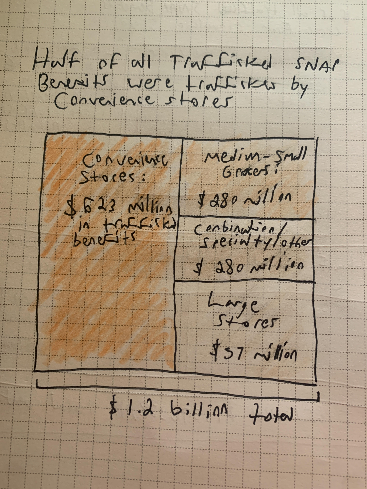

# Assignment 3/4: Critique by Redesign
To return to the front page, click [here](https://jameson-c.github.io/viz-portfolio).
## Critiquing a bad graph (that I made)
This graphic was made for congressional staffers who were working on the big 'farm' bill of the 115th Session of Congress. These bills are only passed every 5 years and have important implications for the SNAP program (also known as food stamps, colloquially). Many of the debates around this time centered around preventing fraud in the program and, because the issue was of congressional interest, my supervisor authored [Errors and Fraud in the Supplemental Nutrition Assistance Program](https://crsreports.congress.gov/product/pdf/R/R45147). I was enlisted to help design data visualizations and perform some general research assistance duties. This graph was meant to give staffers a clear initial view of some seriously overlooked perpetrators of fraud in the program: convenience store retailers. 

Oof. This graphic has haunted me ever since it was published. It hurts to look at. But why? To properly critique this, I utilize Stephen Few's [Data Visualization Effectiveness Profile](http://www.perceptualedge.com/articles/visual_business_intelligence/data_visualization_effectiveness_profile.pdf) as a framework. Overall, I felt that the chart conveyed important, relevant information yet failed to do so in a compelling manner. I would do a lot of things differently: namely reduce the amount of information communicated and focus on one important series instead of three. My explorations below describe my justifications for this, as well as occasional silver linings that I feel could be exploited to make a more compelling graph.

Next, I will describe *why* I gave the ratings shown above. 

### Usefulness
This data visualization has entirely too much going on, though the core of it is useful. I felt that the usefulness was somewhat good because it communicates information relevant to some essential points of the piece: that benefit trafficking perpetuated by retailers has been increasing at convenience stores and that convenience stores have comprised larger shares and numbers of SNAP-approved retailers. The implication of this is that Congress could focus on reforming standards applied to convenience stores if they want to address fraud among retailers. But the usefulness of that context is muddied by the business of the chart. 

### Truthfulness
The only other standard that I felt this graphic did okay with was truthfulness: the y axis begins at 0, and every data point is clearly labeled. The accuracy of the bar charts seems fine to me. However, the second axis for the trafficking and violation rates is hidden and it is hard to know how accurate the depiction of those rates really is. So the line chart element of this does not pass the accuracy test. Both graphical presentations pass the validity test, as the graphic is informing a very specific policy context and does so with little subjective flavor. Overall, I trust the numbers cited as the Congressional Research Service is a nonpartisan federal think-tank that works exclusively for Congress. The USDA report it is citing is heavily reviewed before release and is released on a regular basis.

### Completeness
Regarding completeness, there is way too much information being conveyed here. So this chart violates a central tenant of "the right information and the right amount of it." There are some useful comparisons between the total number of convenience stores vs. other types of retailer. But there are no comparisons conveying one important point, that convenience store benefit trafficking is larger than other store types. So in some ways, the chart is attempting too much while attempting too little. 

### Perceptibility
The perceptibility of the chart is quite subpar, as it forces the eye to bounce around. Additionally, there are four different colors which add little to the ease of interpretation, too many lines breaking up the space, and unclear focus. I am not sure where to put my eyes when I first look at the chart. Additionally, the mixed use of bar charts and line charts make it difficult to focus on either. Making matters worse, the top left quadrant of the graph (where eyes tend to start) has so much going on that I imagine it would be somewhat overwhelming for a viewer.

### Intuitiveness
Similarly, the intuitiveness suffers because of the mixed presentation of the data. Someone who is not used to seeing charts with two axes will probably be confused by the display of percentages and total numbers. Additionally, percentages show up over each bar chart which confuses the percentages labeling the line charts. I think that the only thing helping the chart is its use of conventional graphical styles, which are familiar. But the longer you look, the more confusing it gets.

### Aesthetics
The aesthetics are harmed by many of the observations made prior: there are too many lines boxing in data, too much information being presented in a small space, and too many colors (which are not helpful for interpretation). The chart uses decently attractive colors but does not appear to follow a discernible palette. The business of the chart makes it hard to look at for long. However, I did like the choice of a sans serif font as it is easier to read.

### Engagement
Finally, engagement. Because the chart gives no discernible direction in the title, "Authorization and Trafficking at Convenience Stores, 2006-2014," it does not encourage the reader to search for more. It does not allow the reader a first step of what they should be seeing. That first prompt matters a lot for how a graph is read, and the next questions people ask. Given the extensive ink on the chart and myriad pieces of data, it is tough to say that a reader would leave this wanting more.

## Reflections on the intended audience
I think that it was ineffective because many congressional staffers are strapped for time and the chart was convoluted. On Capitol Hill, you work long hours when your issue is being legislated on. Quick insights are extremely useful; drawn out perspectives can often fall to the wayside. So I imagine that many staffers read the executive summary of the report, went down an saw this first graphic, then probably got confused and indexed to the section that was relevant to them. Because it lacked clarity, I feel that it was thrown aside.

To play devil's advocate, it is not the purpose of CRS to communicate stories, necessarily. CRS is meant to provide objective, authoritative perspectives on relevant topics. The natural restrictions of that ideal strip personality from the work. Still, I think that this graphic could have been improved vastly and retained CRS style.

## The Redesign
This framework informs how I plan on re-designing this graphic. First, I will cut the visualization down to just show the most recent year of data (now 2015-2017) and push previous years to the appendix (a popular trick at CRS and many thinktanks, I suspect). Then, I will make a treemap which compares the volume of trafficking contributed by convenience stores vs. other stores: this gives the reader a sense of what proportion of all trafficked SNAP dollars are attributable to convenience stores, while retaining a sense of total volume. I am not sure about this choice since you lose other important context, but I think that you have to focus on one thing at a time and I am under the impression that staffers care more about reducing large volumes of fraud over small volumes. 

